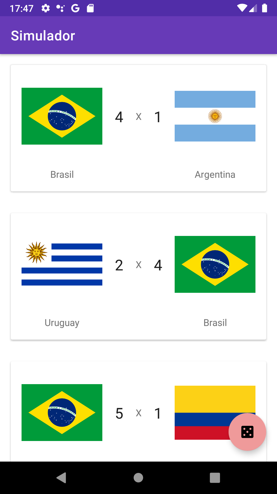
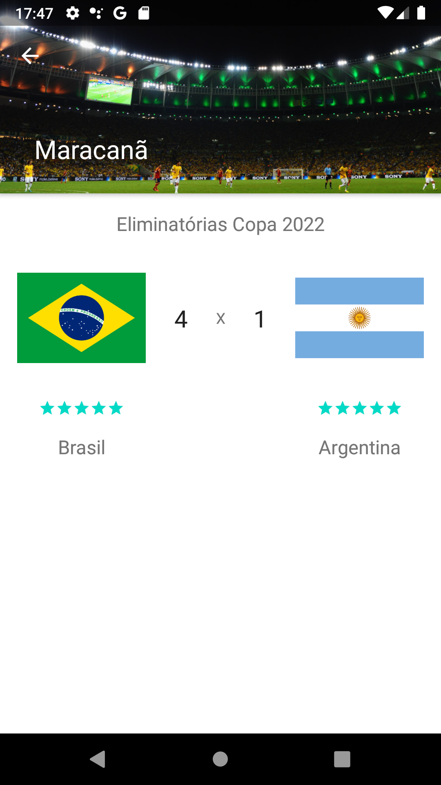

<h1 align="center">
    
</h1>

<h2 align="center">
   
⚽️ App Android Nativo de Simulação de Partidas. 🥅

</h2>

  
  

  <a href="#rocket-tecnologias">Tecnologias</a>&nbsp;&nbsp;&nbsp;|&nbsp;&nbsp;&nbsp;
  <a href="#computer-projeto">Projeto</a>&nbsp;&nbsp;&nbsp;

 
<h3>Imagens da aplicação:<h3>

  
  

## :rocket: Tecnologias
- Kotlin
- Java
- Android

## :computer: Projeto
Projeto feito a partir do bootcamp Sportheca Mobile Dev Week pela plataforma da [DIO.me](https://dio.me/sign-up?ref=EEOY7NWLSR) ministrado pelo [Venilton FalvoJr](https://github.com/falvojr).

## ❗ Desafios pela frente
    - Persistência de dados locais com Room;
    - Boas Práticas e Arquiteturas Recomendadas;
    - Reduzir, ofuscar e otimizar Apps;
    - Publicação de Apps;

## Este repositório foi organizado em algumas branches que representam as implementações realizadas durante os seguintes conteúdos/vídeos:

1. Desenvolvimento Mobile Nativo Para Android
    - [release/desenvolvimento-mobile-nativo-para-android](https://github.com/juliano-soares/matches-simulator-app/tree/release/componentes-layouts-ui-ux-em-apps-android)
2. Componentes, Layouts e UI/UX Em Apps Android
    - [release/componentes-layouts-ui-ux-em-apps-android](https://github.com/juliano-soares/matches-simulator-app/tree/release/desenvolvimento-mobile-nativo-para-android)
3. Java e Kotlin Juntos!? Construindo Apps Android
    - [release/java-e-kotlin-juntos-construindo-apps-android](https://github.com/juliano-soares/matches-simulator-app/tree/release/explorando-o-firebase-para-apps-android-resilientes)
4. Explorando o Firebase Para Apps Android Resilientes
    - [release/explorando-o-firebase-para-apps-android-resilientes](https://github.com/juliano-soares/matches-simulator-app/tree/release/explorando-o-firebase-para-apps-android-resilientes)
